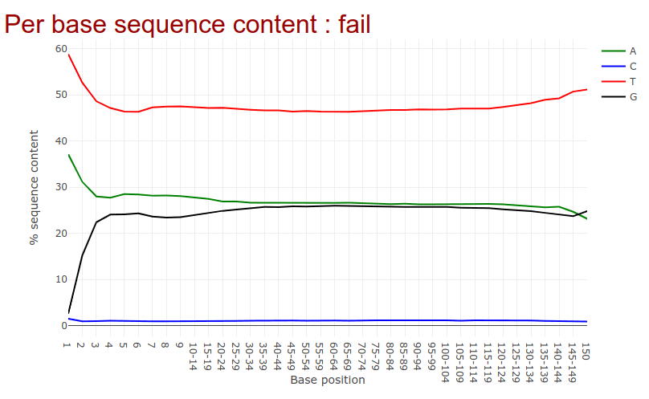
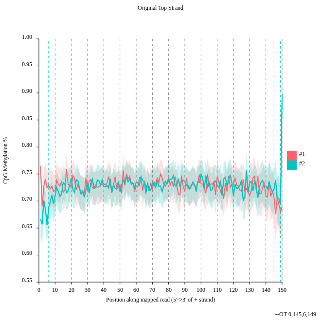
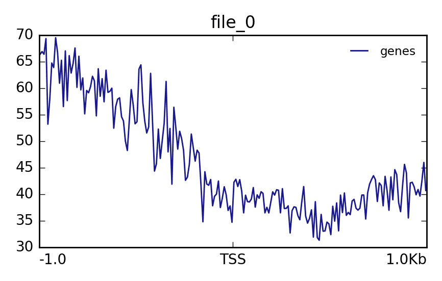
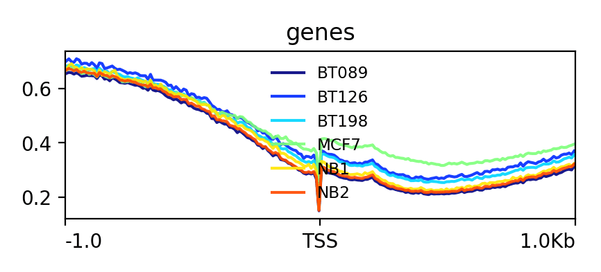

# WGBS-and-Epigenetic-Aging-Clock-Benchmarking-with-Galaxy-and-Biolearn
The repository presents two complementary epigenetics analyses: WGBS processing using the Galaxy methylation-seq tutorial and a Python-based Biolearn benchmark comparing multiple DNA methylation aging clocks across two complete datasets using visual and quantitative performance evaluation.

# DNA Methylation Data Analysis (WGBS) — Galaxy Tutorial

> Step-by-step guide based on [GTN: DNA Methylation data analysis](https://training.galaxyproject.org/training-material/topics/epigenetics/tutorials/methylation-seq/tutorial.html)  
> **Reference:** Lin et al. 2015 | **Genome:** hg38

---

## Overview

Whole Genome Bisulfite Sequencing (WGBS) pipeline on Galaxy covering:

1. [Data Upload](#1-data-upload)
2. [Quality Control — Falco](#2-quality-control-falco)
3. [Alignment — bwameth](#3-alignment-bwameth)
4. [Methylation Bias — MethylDackel](#4-methylation-bias-methyldackel)
5. [Methylation Extraction — MethylDackel](#5-methylation-extraction-methyldackel)
6. [Visualization — computeMatrix & plotProfile](#6-visualization)
7. [DMR Detection — Metilene](#7-metilene)

**Samples:** Normal breast (NB), fibroadenoma (BT089), invasive ductal carcinomas (BT126, BT198), adenocarcinoma cell line (MCF7)

---

## Prerequisites

- Galaxy account (e.g. [usegalaxy.org](https://usegalaxy.org))
- Basic familiarity with Galaxy interface
- Reviewed: [Quality Control tutorial](https://training.galaxyproject.org/training-material/topics/sequence-analysis/tutorials/quality-control/tutorial.html) & [Mapping tutorial](https://training.galaxyproject.org/training-material/topics/sequence-analysis/tutorials/mapping/tutorial.html)

---

## 1. Data Upload

**Goal:** Load subset FASTQ files into Galaxy history.

### Steps

1. Create new history in Galaxy (`+` icon in history panel)
2. Click **Upload** → **Paste/Fetch Data**
3. Paste URLs and press **Start**:

```
https://zenodo.org/record/557099/files/subset_1.fastq
https://zenodo.org/record/557099/files/subset_2.fastq
```

4. Close upload window after completion

> **Alternative:** Import from shared data library → `GTN - Material → Epigenetics → DNA Methylation data analysis`

---

## 2. Quality Control (Falco)

**Tool:** `Falco` v1.2.4+galaxy0  
**Goal:** Assess read quality; understand bisulfite-specific base distribution.

### Steps

1. Search and open **Falco** in Galaxy tool panel
2. Set parameters:
   - **Raw read data:** select both `subset_1.fastq` and `subset_2.fastq` (multi-select with `Ctrl`)
3. Run tool and inspect **Per base sequence content** in HTML report

### Expected Output

Unusual T/C distribution due to bisulfite conversion — all unmethylated C → T.  
GC content will appear skewed. **This is expected.**

> Bisulfite converts unmethylated cytosines to uracil (read as T). Methylated C remains C. Normal QC tools flag this as an error — it is not.



> *Figure 1: Per-base sequence content from Falco for WGBS data. The unusual base distribution is expected after bisulfite conversion.*

**Key observations**
- **Status**: `fail`
- **T** is highly enriched
- **C** is strongly depleted
- This is **normal for WGBS**

---

## 3. Alignment (bwameth)

**Tool:** `bwameth` v0.2.7+galaxy0  
**Goal:** Map bisulfite reads to reference genome using a methylation-aware aligner.

### Steps

1. Open **bwameth** in tool panel
2. Set parameters:

| Parameter | Value |
|-----------|-------|
| Reference genome source | `Use a built-in index` |
| Reference genome | `Human (hg38full)` |
| Library type | `Paired-end` |
| First read in pair | `subset_1.fastq` |
| Second read in pair | `subset_2.fastq` |

3. Run tool

> **Long runtime?** Skip by importing precomputed BAM:
> ```
> https://zenodo.org/records/557099/files/aligned_subset.bam
> ```

> **Why not BWA/Bowtie?** Standard aligners cannot handle C→T conversions. `bwameth` aligns against a 3-letter genome where C is treated as T, then restores proper mapping.

---

## 4. Methylation Bias (MethylDackel)

**Tool:** `MethylDackel` v0.5.2+galaxy0  
**Goal:** Detect position-dependent methylation bias along reads.

### Steps

1. Open **MethylDackel** in tool panel
2. Set parameters:

| Parameter | Value |
|-----------|-------|
| Load reference genome from | `Local cache` |
| Reference genome | `Human (hg38)` |
| Sorted BAM file | output of **bwameth** |
| What do you want to do? | `Determine the position-dependent methylation bias (mbias)` |
| **Advanced options** → Keep singletons | `Yes` |
| **Advanced options** → Keep discordant alignments | `Yes` |

3. Inspect SVG diagnostic plots output



> *Figure 2: CpG methylation bias across read positions in WGBS data. Methylation is largely stable, with only minor variation at the read ends.*

**Key observations**
- **CpG methylation** stays around `~70–75%`
- **#1 and #2** follow similar trends
- Slight bias appears near the read ends
- Overall bias is low

---

## 5. Methylation Extraction (MethylDackel)

**Tool:** `MethylDackel` v0.5.2+galaxy0  
**Goal:** Extract CpG methylation fractions from aligned BAM.

### Steps

1. Open **MethylDackel** again
2. Set parameters:

| Parameter | Value |
|-----------|-------|
| Load reference genome from | `Local cache` |
| Reference genome | `Human (hg38)` |
| Sorted BAM file | output of **bwameth** |
| What do you want to do? | `Extract methylation metrics (extract)` |
| Merge per-Cytosine metrics | `Yes` |
| Output options | `CpG methylation fractions (--fraction)` |

3. Output: BedGraph file with per-CpG methylation fractions

---

## 6. Visualization

**Tools:** `Wig/BedGraph-to-bigWig`, `computeMatrix` v3.5.4, `plotProfile` v3.5.4  
**Goal:** Plot methylation levels around CpG islands.

### Part A — For Extracted Data

1. **Convert to bigWig:**
   - Tool: **Wig/BedGraph-to-bigWig**
   - Input: `fraction CpG` (MethylDackel extract output)
   - If genome not set: edit dataset → set `Database/Build` to `hg38`

2. **Import CpG islands BED:**
   ```
   https://zenodo.org/records/557099/files/CpGIslands.bed
   ```

3. **computeMatrix:**

| Parameter | Value |
|-----------|-------|
| Regions to plot | `CpGIslands.bed` |
| Sample order matters | `No` |
| Score file | output of **Wig/BedGraph-to-bigWig** |
| Output options | `reference-point` |

4. **plotProfile:**
   - Matrix file: output of **computeMatrix**



> *Figure 3: Methylation levels across regions surrounding the TSS. A dip near the TSS suggests lower methylation at gene promoters.*

**Key observations**
- Methylation is **higher away from the TSS**
- Methylation **drops near the TSS**
- The profile suggests **promoter hypomethylation**

### Part B — Multi-Sample Precomputed Data

**Chromosome naming issue:** Ensembl uses `1`, UCSC uses `chr1`. Convert using:

```
https://raw.githubusercontent.com/dpryan79/ChromosomeMappings/master/GRCh38_ensembl2UCSC.txt
```

Use **Replace column** tool (v0.2): replace column 1 of bedGraph using mapping file.

**Import preconverted UCSC files** (save time):

```
https://zenodo.org/records/557099/files/NB1_CpG.meth_ucsc.bedGraph
https://zenodo.org/records/557099/files/NB2_CpG.meth_ucsc.bedGraph
https://zenodo.org/records/557099/files/BT089_CpG.meth_ucsc.bedGraph
https://zenodo.org/records/557099/files/BT126_CpG.meth_ucsc.bedGraph
https://zenodo.org/records/557099/files/BT198_CpG.meth_ucsc.bedGraph
https://zenodo.org/records/557099/files/MCF7_CpG.meth_ucsc.bedgraph
```

**Build collection:**
1. Select all 6 files → **Build List**
2. Rename: strip file extensions (e.g. `NB1_CpG.meth_ucsc.bedGraph` → `NB1_CpG`)
3. Label collection: `all_coverage_files`
4. Set datatype to `bedgraph` and database to `hg38` for all files

**Run pipeline on collection:**

```
Wig/BedGraph-to-bigWig (collection input)
    ↓
computeMatrix (reference-point, CpGIslands.bed)
    ↓
plotProfile (Show advanced options: Yes → Make one plot per group: Yes)
```

### Expected Output

Methylation dip at CpG island centers — consistent with promoter silencing pattern across samples.



> *Figure 4: Methylation profiles around the TSS for multiple samples. A common dip near the TSS suggests reduced promoter methylation across samples.*

**Key observations**
- Methylation decreases near the **TSS** in all samples
- **MCF7** shows the highest methylation
- **NB1/NB2** show lower methylation
- Tumor samples show intermediate profiles

---

## 7. Metilene

**Tool:** `Metilene` v0.2.6.1  
**Goal:** Detect differentially methylated regions (DMRs) between normal and tumor samples.

### Steps

1. Import bedGraph files from Zenodo:

```
https://zenodo.org/records/557099/files/NB1_CpG.meth.bedGraph
https://zenodo.org/records/557099/files/NB2_CpG.meth.bedGraph
https://zenodo.org/records/557099/files/BT198_CpG.meth.bedGraph
```

2. Open **Metilene** and set parameters:

| Parameter | Value |
|-----------|-------|
| Input group 1 | `NB1_CpG.meth.bedGraph` + `NB2_CpG.meth.bedGraph` |
| Input group 2 | `BT198_CpG.meth.bedGraph` |
| BED file (regions of interest) | `CpGIslands.bed` |

3. Run tool and inspect PDF output

### Output Plots (PDF)

| Plot | Description |
|------|-------------|
| DMR differences distribution | Magnitude of methylation changes |
| DMR length (bp) | Size distribution of DMRs |
| Number of CpGs per DMR | CpG density in DMRs |
| DMR diff vs. q-values | Statistical significance |
| Mean methylation G1 vs G2 | Group comparison scatter |
| DMR length (bp) vs length (CpGs) | Correlation of DMR metrics |

---

## Workflow Summary

```
FASTQ reads (subset_1, subset_2)
    ↓
Falco (QC)
    ↓
bwameth (Alignment, hg38)
    ↓
MethylDackel mbias (Bias check)
    ↓
MethylDackel extract (CpG fractions → BedGraph)
    ↓
Wig/BedGraph-to-bigWig → computeMatrix → plotProfile (Visualization)
    ↓
Metilene (DMR detection)
```

---

## Data Sources

All data: [Zenodo record 557099](https://zenodo.org/record/557099)

---

## Key Concepts

| Concept | Explanation |
|---------|-------------|
| Bisulfite conversion | Unmethylated C → T; methylated C stays C |
| Why special aligner? | Standard aligners fail on C→T converted reads |
| Methylation bias | Position-dependent artifacts at read ends |
| DMR | Region with significantly different methylation between conditions |
| CpG island | CpG-rich genomic region, often at gene promoters |
| Chromosome naming | Ensembl (`1`) vs UCSC (`chr1`) — must match reference |

---

## Reference

Lin, I.-H. et al. (2015). **Hierarchical Clustering of Breast Cancer Methylomes Revealed Differentially Methylated and Expressed Breast Cancer Genes.** *PLOS ONE* 10: e0118453. [doi:10.1371/journal.pone.0118453](https://doi.org/10.1371/journal.pone.0118453)

**Tutorial:** Wolff, Ryan, Moosmann — [GTN DNA Methylation data analysis](https://training.galaxyproject.org/training-material/topics/epigenetics/tutorials/methylation-seq/tutorial.html)


# Benchmarking Multiple Epigenetic Aging Clocks on Two Biolearn Datasets

> Benchmarks 8 DNA methylation–based aging clocks from the **Bio-Learn** framework across two complete EPIC array datasets.  
> Compares correlation structure, chronological age deviation, and prediction performance using MAE, RMSE, and Pearson r.

---

## Overview

Epigenetic clocks estimate biological age from DNA methylation patterns measured on Illumina EPIC (850k) or 450k arrays. This project benchmarks **8 aging clocks** on **2 complete Biolearn datasets** and evaluates:

- How well clocks correlate with each other across datasets
- Per-sample deviation from chronological age
- Predictive accuracy (MAE, RMSE, Pearson r)

---

## Datasets

Both datasets are loaded via the **Biolearn `DataLibrary`** and contain blood-derived EPIC array DNA methylation data with complete chronological age metadata.

| Dataset | Samples | CpG Sites | Age Range | Description |
|---------|---------|-----------|-----------|-------------|
| **GSE120307** | 34 | 485,512 | 19–54 yrs | Blood DNA methylation dataset; commonly used in Biolearn examples |
| **GSE41169** | 95 | 485,577 | 18–65 yrs | Blood DNA methylation from a Dutch population cohort |

**Why these two?**  
Both datasets have complete, non-missing chronological age metadata for every sample — a strict requirement for evaluating aging clock accuracy. GSE120307 provides a younger/tighter age range while GSE41169 provides a broader demographic spread, enabling cross-dataset generalizability assessment.

---

## Aging Clocks / Models Selected

All 8 clocks are loaded from the Biolearn **`ModelGallery`**. These span first- and second-generation epigenetic clocks trained on blood methylation data.

| # | Clock | Reference | Type | Key Feature |
|---|-------|-----------|------|-------------|
| 1 | **Horvath** (2013) | Horvath, *Genome Biology* 2013 | First-gen | Pan-tissue; 353 CpGs; trained on mixed tissues |
| 2 | **Hannum** (2013) | Hannum et al., *Mol Cell* 2013 | First-gen | Blood-specific; 71 CpGs; linear elastic net |
| 3 | **SkinBloodClock** | Horvath et al., 2018 | First-gen | Skin & blood optimized; 391 CpGs |
| 4 | **PhenoAge** | Levine et al., *Aging* 2018 | Second-gen | Phenotypic age; trained on clinical biomarkers + DNAm |
| 5 | **GrimAge** | Lu et al., *Aging* 2019 | Second-gen | Mortality predictor; composite of DNAm surrogates |
| 6 | **DunedinPACE** | Belsky et al., *eLife* 2022 | Pace-of-aging | Rate of biological aging (not static age) |
| 7 | **PCHorvath1** | Zhang et al., 2019 | PC-based | Principal-component version of Horvath; noise-robust |
| 8 | **PCGrimAge** | Zhang et al., 2019 | PC-based | Principal-component version of GrimAge; noise-robust |

**Clock generations explained:**
- **First-gen clocks** (Horvath, Hannum): predict chronological age directly; high accuracy, lower disease relevance
- **Second-gen clocks** (PhenoAge, GrimAge): predict biological age tied to health/mortality outcomes
- **Pace-of-aging** (DunedinPACE): measures *rate* of aging rather than current age
- **PC-based clocks** (PCHorvath1, PCGrimAge): denoised versions using PCA; more stable across platforms

---

##  Notebook Explaination

### 1. Install and Import Required Libraries

Installs the `biolearn` package and imports the standard scientific Python stack.

```python
!pip install -q biolearn

import numpy as np
import pandas as pd
import matplotlib.pyplot as plt

from biolearn.data_library import DataLibrary
from biolearn.model_gallery import ModelGallery
from biolearn.visualize import (
    plot_clock_correlation_matrix,
    plot_clock_deviation_heatmap,
    plot_age_prediction
)
```

- `DataLibrary` — access curated GEO methylation datasets
- `ModelGallery` — load pre-trained aging clock models
- Visualization utilities — generate all three required comparison plots

---

### 2. Load Two Complete Biolearn Datasets

Downloads and parses both datasets into Biolearn `Dataset` objects containing `.dnam` (methylation β-value matrix) and `.metadata` (age, sex, etc.).

```python
dataset_ids = ["GSE120307", "GSE41169"]
library = DataLibrary()

datasets = {}
for ds_id in dataset_ids:
    datasets[ds_id] = library.get(ds_id).load()
```

---

### 3. Summarize the Selected Datasets

Produces a summary table with sample count, CpG site count, and age range for each dataset.

```
     Dataset  Samples  CpG Sites  Age Min  Age Max
0  GSE120307       34     485512     19.0     54.0
1   GSE41169       95     485577     18.0     65.0
```

---

### 4. Select and Configure Aging Clocks

Loads 8 clocks from `ModelGallery` and stores metadata for annotation in downstream plots.

```python
gallery = ModelGallery()

clock_names = [
    "Horvath", "Hannum", "SkinBloodClock",
    "PhenoAge", "GrimAge", "DunedinPACE",
    "PCHorvath1", "PCGrimAge"
]

clocks = {name: gallery.get(name) for name in clock_names}
```

---

### 5. Run Clock Predictions on Both Datasets

Applies all 8 clocks to each dataset. Predicted ages are collected into a results DataFrame alongside chronological ages.

```python
results = {}
for ds_id, ds in datasets.items():
    preds = {}
    for name, clock in clocks.items():
        preds[name] = clock.predict(ds)
    results[ds_id] = pd.DataFrame(preds)
    results[ds_id]["ChronologicalAge"] = ds.metadata["age"].values
```

---

### 6. Visualize Clock Correlation Matrix (Both Datasets)

**Goal:** Show inter-clock agreement. Highly correlated clocks may be redundant; divergent ones capture distinct biology.

One Pearson correlation heatmap is produced **per dataset** across all 8 clock predictions.

```python
for ds_id in dataset_ids:
    plot_clock_correlation_matrix(
        results[ds_id][clock_names],
        title=f"Clock Correlation — {ds_id}"
    )
    plt.show()
```

**Reading the plot:**
- Dark red = high positive correlation (clocks agree)
- White/blue = low or negative correlation (clocks diverge)
- PC-based clocks typically cluster with their parent clocks

---

### 7. Visualize Clock Deviation Heatmap (Both Datasets)

**Goal:** Show per-sample biological age acceleration (`predicted − chronological`) across all clocks. Reveals which samples age fast/slow and whether clocks consistently agree on outliers.

```python
for ds_id in dataset_ids:
    deviation = results[ds_id][clock_names].subtract(
        results[ds_id]["ChronologicalAge"], axis=0
    )
    plot_clock_deviation_heatmap(
        deviation,
        title=f"Age Deviation Heatmap — {ds_id}"
    )
    plt.show()
```

**Reading the plot:**
- Rows = samples, Columns = clocks
- Red = biological age acceleration (predicted > chronological)
- Blue = biological age deceleration (predicted < chronological)
- Consistent row color across clocks = strong biological aging signal in that sample

---

### 8. Visualize Aging Clock Predictions vs Chronological Age (Both Datasets)

**Goal:** Scatter plot of predicted vs. chronological age per clock. An ideal clock has all points on the diagonal (y = x).

```python
for ds_id in dataset_ids:
    for clock_name in clock_names:
        plot_age_prediction(
            chronological=results[ds_id]["ChronologicalAge"],
            predicted=results[ds_id][clock_name],
            title=f"{clock_name} — {ds_id}"
        )
        plt.show()
```

One scatter panel per clock per dataset with regression line and R² annotation.

---

### 9. Compute Quantitative Benchmark Metrics

Computes **MAE**, **RMSE**, and **Pearson r** for each clock × dataset combination.

```python
from sklearn.metrics import mean_absolute_error
from scipy.stats import pearsonr

metrics = []
for ds_id in dataset_ids:
    chron = results[ds_id]["ChronologicalAge"]
    for clock in clock_names:
        pred = results[ds_id][clock]
        mae  = mean_absolute_error(chron, pred)
        rmse = np.sqrt(((pred - chron) ** 2).mean())
        r, _ = pearsonr(chron, pred)
        metrics.append({
            "Dataset": ds_id, "Clock": clock,
            "MAE": mae, "RMSE": rmse, "Pearson_r": r
        })

metrics_df = pd.DataFrame(metrics)
display(metrics_df)
```

| Metric | Direction | Interpretation |
|--------|-----------|----------------|
| **MAE** | Lower = better | Mean absolute error in years |
| **RMSE** | Lower = better | Penalizes large outlier deviations |
| **Pearson r** | Higher = better | Rank agreement with chronological age |

---

### 10. Benchmark Summary Bar Charts

Bar chart comparison of MAE and Pearson r across all clocks for both datasets — a quick visual summary of relative clock performance.

```python
fig, axes = plt.subplots(1, 2, figsize=(14, 5))

for i, (metric, ax) in enumerate(zip(["MAE", "Pearson_r"], axes)):
    for ds_id in dataset_ids:
        subset = metrics_df[metrics_df["Dataset"] == ds_id]
        ax.bar(subset["Clock"], subset[metric], label=ds_id, alpha=0.7)
    ax.set_title(metric)
    ax.set_xticklabels(clock_names, rotation=45, ha="right")
    ax.legend()

plt.tight_layout()
plt.show()
```

- **MAE plot:** lower bars = better predictors
- **Pearson r plot:** taller bars = stronger correlation with chronological age

---

## Requirements

```
biolearn
numpy
pandas
matplotlib
scikit-learn
scipy
```

Install:

```bash
pip install biolearn numpy pandas matplotlib scikit-learn scipy
```

---

## Run

Open in **Google Colab** (recommended) or local Jupyter:

Run all cells top to bottom. Dataset download (~500 MB) requires internet on first run.

---

## Key References

| Clock | Citation |
|-------|----------|
| Horvath | Horvath S. *Genome Biology* 2013; 14:R115 |
| Hannum | Hannum G et al. *Mol Cell* 2013; 49(2):359–367 |
| SkinBloodClock | Horvath S et al. *Aging* 2018; 10(7):1758–1775 |
| PhenoAge | Levine ME et al. *Aging* 2018; 10(4):573–591 |
| GrimAge | Lu AT et al. *Aging* 2019; 11(2):303–327 |
| DunedinPACE | Belsky DW et al. *eLife* 2022; 11:e73420 |
| PC Clocks | Zhang Q et al. *Aging* 2019; 11(21):9533–9545 |
| Biolearn | [github.com/bio-learn/biolearn](https://github.com/bio-learn/biolearn) |
